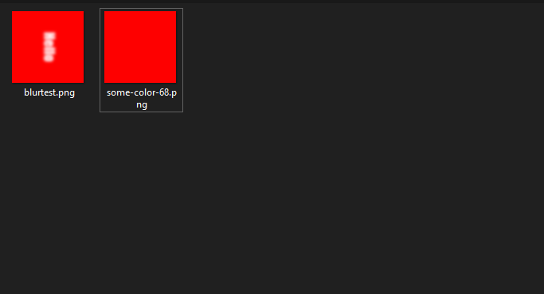

# $downloadCanvas

It downloads the canvas to "DownloadFolder" folder.

---

## Usage

```
$downloadCanvas[canvas;filename?]
```

## Parameters

| Field | Type | Description | Required |
| ----- | ---- | ----------- | :------: |
| canvas | string | Name of the canvas. | yes |
| filename | string | Name of the canvas png file. | no |

## Example(s)

It will create new color canvas and download it to folder.

```js
bot.command({
    name: "d-color",
    code: `
    $downloadCanvas[somename;some-color-$random[1;100]]
    $fillRect[somename;0;0;512;512]
    $canvasColor[somename;$message[1]]
    $createCanvas[somename]
    $onlyIf[$isValidHex[$message[1]]==true;Please provide a valid hex.]
    `
});
``` 

### Showcase

