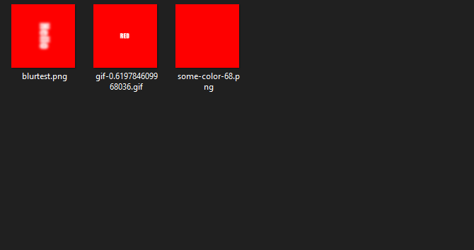

# $downloadGIF

It downloads the canvas to "DownloadFolder" folder.

---

## Usage

```
$downloadGIF[gif;filename?]
```

## Parameters

| Field | Type | Description | Required |
| ----- | ---- | ----------- | :------: |
| gif | string | Name of the gif. | yes |
| filename | string | Name of the gif file. | no |

## Example(s)

It will create new color gif and download it to folder.

```js
bot.command({
    name: "dgif",
    code: `
    $downloadGIF[colorgif]
    $gifFinish[colorgif]
    $addFrame[colorgif;somename]
    $drawText[somename;YELLOW;$sub[335;$measureText[somename;YELLOW;width]];275]
    $canvasColor[somename;#FFFFFF]
    $fillRect[somename;0;0;512;512]
    $canvasColor[somename;#FFFF00]
    $addFrame[colorgif;somename]
    $drawText[somename;BLUE;$sub[305;$measureText[somename;BLUE;width]];275]
    $canvasColor[somename;#FFFFFF]
    $fillRect[somename;0;0;512;512]
    $canvasColor[somename;#0000FF]
    $addFrame[colorgif;somename]
    $drawText[somename;GREEN;$sub[315;$measureText[somename;GREEN;width]];275]
    $canvasColor[somename;#FFFFFF]
    $fillRect[somename;0;0;512;512]
    $canvasColor[somename;#00FF00]
    $addFrame[colorgif;somename]
    $drawText[somename;RED;215;275]
    $canvasColor[somename;#FFFFFF]
    $fillRect[somename;0;0;512;512]
    $canvasColor[somename;#FF0000]
    $gifStart[colorgif]
    $setGIF[colorgif;delay;500]
    $createGIF[colorgif]
    $font[somename;50px Impact]
    $createCanvas[somename;512;512]
    `
});
``` 

### Showcase

