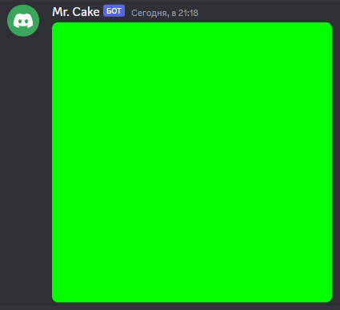

# $sendCanvas

It sends the canvas.

---

## Usage

```
$sendCanvas[canvas;type?(msg/image);index?]
```

## Parameters

| Field | Type | Description | Required |
| ----- | ---- | ----------- | :------: |
| canvas | string | Name of the canvas. | yes |
| type | string | Type. | no |
| index | number | Index of embed. | no |

## Example(s)

It will send new color canvas.

```js
bot.command({
    name: "color",
    code: `
    $sendCanvas[somename]
    $fillRect[somename;0;0;512;512]
    $canvasColor[somename;$message[1]]
    $createCanvas[somename]
    $onlyIf[$isValidHex[$message[1]]==true;Please provide a valid hex.]
    `
});
``` 

### Showcase

