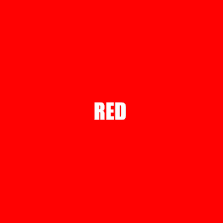

# $sendGIF

It sets gif property. (delay, quality, threshold, repeat)

---

## Usage

```
$sendGIF[gif;type?(msg/image);index?]
```

## Parameters

| Field | Type | Description | Required |
| ----- | ---- | ----------- | :------: |
| gif | string | Name of the gif. | yes |
| type | string | Type. | no |
| index | number | Index of embed. | no |

## Example(s)

This will make colored gif. (red -> green -> blue -> yellow)

```js
bot.command({
    name: "gif",
    code: `
    $sendGIF[colorgif]
    $gifFinish[colorgif]
    $addFrame[colorgif;somename]
    $drawText[somename;YELLOW;$sub[335;$measureText[somename;YELLOW;width]];275]
    $canvasColor[somename;#FFFFFF]
    $fillRect[somename;0;0;512;512]
    $canvasColor[somename;#FFFF00]
    $addFrame[colorgif;somename]
    $drawText[somename;BLUE;$sub[305;$measureText[somename;BLUE;width]];275]
    $canvasColor[somename;#FFFFFF]
    $fillRect[somename;0;0;512;512]
    $canvasColor[somename;#0000FF]
    $addFrame[colorgif;somename]
    $drawText[somename;GREEN;$sub[315;$measureText[somename;GREEN;width]];275]
    $canvasColor[somename;#FFFFFF]
    $fillRect[somename;0;0;512;512]
    $canvasColor[somename;#00FF00]
    $addFrame[colorgif;somename]
    $drawText[somename;RED;215;275]
    $canvasColor[somename;#FFFFFF]
    $fillRect[somename;0;0;512;512]
    $canvasColor[somename;#FF0000]
    $gifStart[colorgif]
    $setGIF[colorgif;delay;500]
    $createGIF[colorgif]
    $font[somename;50px Impact]
    $createCanvas[somename;512;512]
    `
});
``` 

### Showcase

