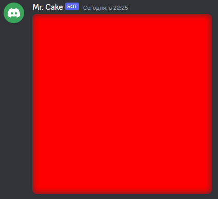

# $setCFilter

It sets filter in canvas.

---

## Usage

```
$setCFilter[canvas;filter;value]
```

**Filters: blur, grayscale, sepia, brightness, contrast, invert, saturate**

## Parameters

| Field | Type | Description | Required |
| ----- | ---- | ----------- | :------: |
| canvas | string | Name of the canvas. | yes |
| filter | string | Filter. | yes |
| value | number | Value of filter. | yes |

## Example(s)

It will send new blurred/neon color canvas.

```js
bot.command({
    name: "bcolor",
    code: `
    $sendCanvas[somename]
    $fillRect[somename;0;0;512;512]
    $setCFilter[somename;blur;10]
    $canvasColor[somename;$message[1]]
    $createCanvas[somename]
    $onlyIf[$isValidHex[$message[1]]==true;Please provide a valid hex.]
    `
});
``` 

### Showcase

