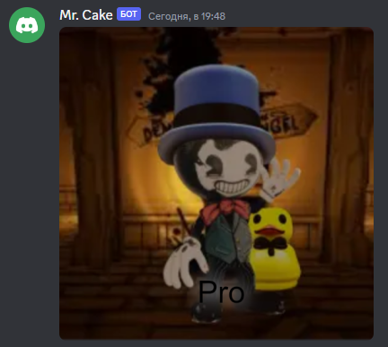

# $setShadow

It adds shadow to the canvas.

---

## Usage

```
$setShadow[canvas;size]
```

## Parameters

| Field | Type | Description | Required |
| ----- | ---- | ----------- | :------: |
| canvas | string | Name of the canvas. | yes |
| size | number | Size of shadow. | yes |

## Example(s)

This will make canvas with name "pro" and pro image of author.

```js
bot.command({
    name: "pro",
    code: `
    $sendCanvas[pro]
    $drawText[pro;Pro;225;450]
    $setShadow[pro;20]
    $canvasColor[pro;#FFFFFF;shadow]
    $font[pro;50px Arial]
    $canvasColor[pro;#000000]
    $drawImage[pro;avatar;0;0;512;512]
    $loadImage[pro;avatar;url;$nonEscape[$authorAvatar]]
    $createCanvas[pro;512;512]
    `
});
```

### Showcase

