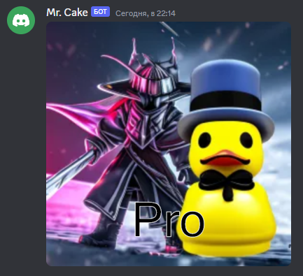

# $strokeText

It draws text outlines in canvas.

---

## Usage

```
$strokeText[canvas;text;x;y;strokesize?]
```

## Parameters

| Field | Type | Description | Required |
| ----- | ---- | ----------- | :------: |
| canvas | string | Name of the canvas. | yes |
| text | string | Text to draw. | yes |
| x | number | X position of the text. | yes |
| y | number | Y position of the text. | yes |
| strokesize | number | Stroke size. | yes |

## Example(s)

This will make canvas with name "pro" and pro image of author.

```js
bot.command({
    name: "pro",
    code: `
    $sendCanvas[pro]
    $strokeText[pro;Pro;center;450;1]
    $canvasColor[pro;#FFFFFF;stroke]
    $drawText[pro;Pro;center;450]
    $font[pro;100px Microsoft Sans Serif']
    $canvasColor[pro;#000000]
    $drawImage[pro;avatar;0;0;512;512]
    $loadImage[pro;avatar;url;$nonEscape[$authorAvatar]]
    $createCanvas[pro;512;512]
    `
});
``` 

### Showcase

