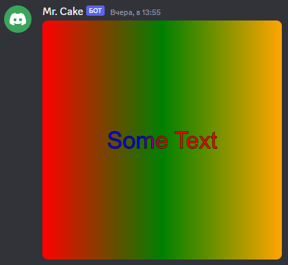

# LinearGradient

It creates **linear** gradient.

---

## Usage

```
{lineargradient:id:startX:startY:endX:endY:...colorStop(s)}
``` 

## Parameters

| Field | Type | Description | Required |
| ----- | ---- | ----------- | :------: |
| id | string | The gradient id. | yes |
| startX | number | Gradient start x position. | yes |
| startY | number | Gradient start y position. | yes |
| endX | number | Gradient end x position | yes |
| endY | number | Gradient end y position | yes |
| colorStops | position:color | Gradient color stops. | yes |

## More Info

It just creates **linear** gradient.

If you want to use it, put ``gradientID=yourGradientID`` in color parameter. (works almost everywhere)

## Example(s)

```js
bot.command({
    name: "lgradient",
    code: `
        $sendCanvas[test]
        $canvasBuilder[
            {settings:test:512:512}
            
            {lineargradient:somegradientid:$math[512/2/1.2]:0:$math[512/2]:0:1:red:0:blue}
            {rect:lineargradient=0/0/512/0/0/red/0.5/green/1/orange:0:0}
            {text:Some Text:50px Arial:gradientID=somegradientid:center:center}
            {stroketext:Some Text:50px Arial:#000000:center:center:1}
        ]
    `
})
```

### Showcase
 
