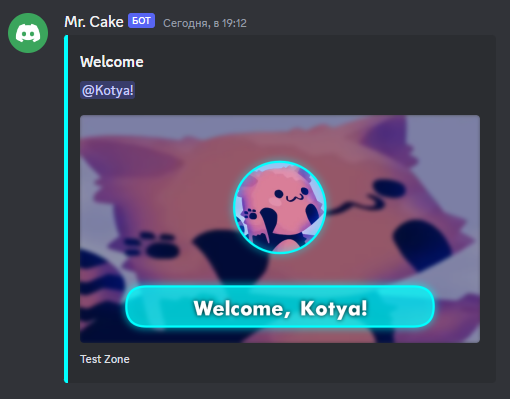

# Stroke

Adds stroke to the canvas.
Use after thing.

---

## Usage

```
{stroke:color?:size?}
``` 

## Parameters

| Field | Type | Description | Required |
| ----- | ---- | ----------- | :------: |
| color | string | The color of stroke. | no |
| size | number | The stroke size. | no |

## More Info

It just adds stroke to the canvas.

## Example(s)
 
```js
bot.joinCommand({
   channel: "$guildSystemChannelID[$guildID]",
   code: `
$sendCanvas[welcom;image]
$title[Welcome]
$description[<@$authorID>]
$color[$get[thatcolor]]
$footer[$guildName[$guildID]]
$canvasBuilder[
 {settings:welcom:900:512}
 {addeffect:blur:$get[blurvalue]} -- Remove if dont want blurred background
 {image:url:$replaceText[$nonEscape[$get[background]];:;&COLON&]:0:0} 
 {rect:#00000050:0:0:900:512} -- Remove if dont want a darker background.
 {effect}
 {shadow:13:$get[thatcolor]}
 {rect:$get[thatcolor]99:105:385:$math[900-105*2]:90:$math[90/2]}
 {stroke:$get[thatcolor]:5}
 {image:url:$replaceText[$nonEscape[$authorAvatar];:;&COLON&]:center:105:205:205:%circle%}
 {stroke:$get[thatcolor]:5}
 {shadow:7.5:$get[textshadowcolor]}
 {text:Welcome, $username:50px Futura-Bold:$get[textcolor]:center:450}
]

$let[background;$authorAvatar]
$let[blurvalue;5]
$let[thatcolor;#00FFFF]
$let[textcolor;#FFFFFF]
$let[textshadowcolor;#000000]
   `
});
``` 

### Showcase

