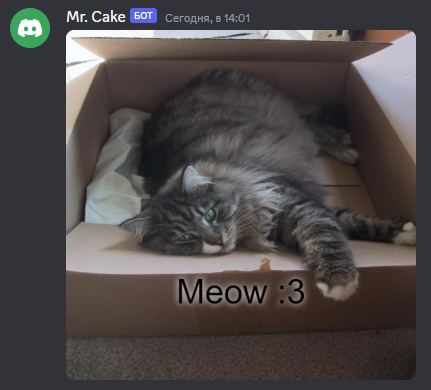

# Text

Adds some text to the canvas. 

---

## Usage

```
{text:text:font:color?:x?:y?}
``` 

## Parameters

| Field | Type | Description | Required |
| ----- | ---- | ----------- | :------: |
| text | string | The text. | yes |
| font | string | The path to image. | yes |
| color | hex | The text color. | no |
| x | number | The x position. | no |
| y | number | The y position. | no |

## More Info

It just draws text.

You can also:
- use `center` as x
- use `center` as y

## Example(s)
 
```js
bot.command({
    name: "cat",
    code: `
    $sendCanvas[cat]
    $canvasBuilder[
        {settings:cat:512:512}
        {image:url:$replaceText[$nonEscape[$get[url]];:;&COLON&]:0:0}
        {shadow:7.5:#FFFFFF}
        {text:Meow &COLON&3:50px Arial::center:400}
    ]
    $let[url;$jsonRequest[https://ild.vercel.app/api/cat;image]]
    `
});

```

### Showcase

